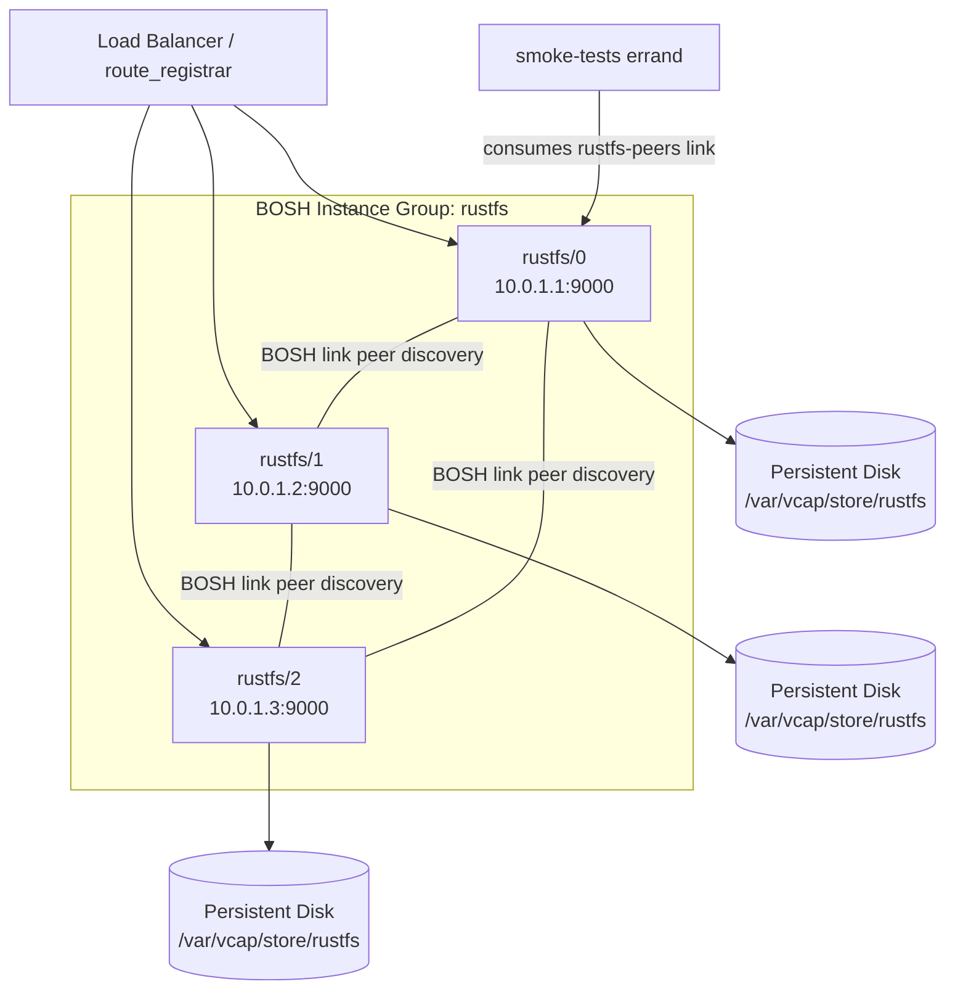

# rustfs-boshrelease

> ⚠ **PRE-RELEASE WARNING** ⚠
>
> RustFS upstream is currently pre-release (1.0.0-beta.3 as of 2026-05).
> The distributed/cluster mode is marked "Under Testing" upstream.
> Use this BOSH release for evaluation and non-production workloads only.
> Pin to a specific upstream binary version; do not assume API stability.

---

> **WARNING: RustFS Distributed Mode — Under Testing**
>
> RustFS 1.0.0-beta.3 explicitly marks "Distributed Mode: Under Testing" in its feature
> matrix. This BOSH release enables cluster mode when instances > 1, but cluster
> stability, data durability, and node rejoin behavior have NOT been validated by the
> FiveTwenty team or the RustFS project for production use.
>
> **Risk profile:**
>
> - Data loss is possible on cluster restart or partial failure
>
> - Erasure coding parameters (k, m) are not user-configurable
>
> - Node rejoin semantics after crash are undocumented
>
> - Minimum viable cluster size is unspecified (4 nodes × 4 drives assumed from Docker examples)
>
> **Recommended safe usage until RustFS reaches GA:**
>
> - Single-node mode with `manifests/ops/standalone.yml` ops file
>
> - External backup via SHIELD or equivalent
>
> - Monitor https://github.com/rustfs/rustfs for GA release announcement

---

A BOSH release for [RustFS](https://github.com/rustfs/rustfs), an S3-compatible object
storage server written in Rust.

## Overview

This release deploys RustFS 1.0.0-beta.3 with BOSH-link-driven peer discovery for
cluster mode. It packages the pre-built musl-linked Linux binary from the official
RustFS GitHub releases. Deployments scale from a single evaluation node (using
`manifests/ops/standalone.yml`) up to a multi-node distributed cluster. BPM manages
the process lifecycle. The release targets Ubuntu Noble (24.04) stemcells, which
provide the kernel 6.x required for IO-Uring support.

## Features

- **S3-compatible API** — port 9000, compatible with AWS SDK, mc, boto3, and s3cmd

- **Web console** — port 9001, optional (enabled by default)

- **BOSH-link peer discovery** — cluster scales from 1 to N nodes without manual config

- **BPM process management** — persistent disk, ephemeral tmp dir, vcap user isolation

- **KMS integration** — local key or HashiCorp Vault / OpenBao backend (optional)

- **Health endpoints** — `/health` and `/health/ready` for load balancer integration

- **Smoke-tests errand** — validates S3 put/get/delete cycle post-deploy

## Requirements

| Requirement | Minimum |
|-------------|---------|
| Stemcell | ubuntu-noble (24.04, kernel 6.x) |
| BOSH director | v271 or later |
| Kernel (IO-Uring) | 5.1 or later |
| Persistent disk per node | 50 GiB (recommended) |
| Ports open between nodes | 9000 (S3 API + gRPC internode) |

## Quick Start

If you use [Genesis](https://github.com/genesis-community), the
[rustfs-genesis-kit](https://github.com/genesis-community/rustfs-genesis-kit) wraps
this release with environment-aware defaults, credential generation, and
`genesis do` addon support.

### Prerequisites

- BOSH director with bpm release available
- Ubuntu Noble stemcell uploaded
- Persistent disk plan configured in cloud-config
- Ports 9000 and 9001 open between cluster nodes

### Fetch blobs

Before creating a dev release, download and register the RustFS binary blob:

```bash
curl -Lo /tmp/rustfs-linux-x86_64-musl-1.0.0-beta.3.zip \
  https://github.com/rustfs/rustfs/releases/download/1.0.0-beta.3/rustfs-linux-x86_64-musl-v1.0.0-beta.3.zip

bosh add-blob /tmp/rustfs-linux-x86_64-musl-1.0.0-beta.3.zip \
  rustfs/rustfs-linux-x86_64-musl-1.0.0-beta.3.zip
```

### Create a dev release

```bash
bosh create-release --force
bosh upload-release
```

### Deploy (3-node cluster)

```bash
bosh deploy -d rustfs manifests/rustfs.yml \
  -v rustfs_access_key=myaccesskey \
  -v rustfs_secret_key=mysecretkey8chars
```

### Deploy (single node — recommended for evaluation)

```bash
bosh deploy -d rustfs manifests/rustfs.yml \
  -o manifests/ops/standalone.yml \
  -v rustfs_access_key=myaccesskey \
  -v rustfs_secret_key=mysecretkey8chars
```

### Run smoke tests

```bash
bosh -d rustfs run-errand smoke-tests
```

## Properties

The following table covers the most commonly set properties. See
`jobs/rustfs-server/spec` for the full property list with descriptions.

| Property | Default | Description |
|----------|---------|-------------|
| `rustfs.access_key` | required | Admin access key (RUSTFS_ACCESS_KEY). Min 3 chars. |
| `rustfs.secret_key` | required | Admin secret key (RUSTFS_SECRET_KEY). Min 8 chars. |
| `rustfs.port` | `9000` | S3 API and internode gRPC port |
| `rustfs.console_port` | `9001` | Web console port |
| `rustfs.console_enable` | `true` | Enable web console |
| `rustfs.log_level` | `info` | Log level: trace, debug, info, warn, error |
| `rustfs.persistent_disk_path` | `/var/vcap/store/rustfs` | Base path for data volumes |
| `rustfs.volumes_per_node` | `4` | Sub-directories per node for erasure coding |
| `rustfs.region` | `us-east-1` | S3 region string |
| `rustfs.server_domains` | `""` | Comma-separated virtual-hosted-style domains |
| `rustfs.health_enable` | `true` | Enable /health and /health/ready endpoints |
| `rustfs.kms.enable` | `false` | Enable server-side encryption |
| `rustfs.kms.backend` | `local` | KMS backend: local, vault, vault-kv2, vault-transit |

## Cluster Mode Notes

When `instances > 1`, the `rustfs-server` job uses the BOSH `rustfs-peers` link to
collect all peer IP addresses and constructs the `RUSTFS_VOLUMES` environment variable
with one URL per peer per data sub-directory. The manifest sets `update.serial: true`
and `max_in_flight: 1` to ensure nodes start sequentially, which is required for
initial cluster formation.

Minimum recommended cluster size is 3 nodes with `volumes_per_node: 4` (matching
the upstream Docker Compose examples). Fewer nodes or volumes may produce unexpected
erasure-coding behavior.

**Single-node mode** (`manifests/ops/standalone.yml`) sets `instances: 1` and
`volumes_per_node: 1`. In this mode there is no erasure coding and no data
redundancy — use external backup.

## Architecture



## Packages

| Package | Contents |
|---------|---------|
| `rustfs` | Pre-built RustFS binary (linux-x86_64-musl, 1.0.0-beta.3) |

## Smoke Tests

The `smoke-tests` errand performs:

1. HTTP GET `/health` on every cluster peer — all must return 200
2. S3 `CreateBucket` on the primary peer
3. S3 `PutObject` — writes a test payload
4. S3 `GetObject` — reads and verifies content matches
5. S3 `DeleteObject` — removes the object
6. S3 `HeadObject` confirms 404 — verifies deletion

The errand uses Python 3 + boto3. Ubuntu Noble includes Python 3.12; boto3 must be
available either via a `python-packages` blob or pre-installed on the stemcell. If
boto3 is unavailable, install it or switch to the `mc` binary approach (bundle as a
separate blob).

Run the errand after every deploy:

```bash
bosh -d rustfs run-errand smoke-tests
```

## Release Process

1. Update the blob in `config/blobs.yml` when a new RustFS upstream version is available
2. Update `packages/rustfs/spec` and `packages/rustfs/packaging` to reference the new blob name
3. Update `README.md` version references
4. Run `bosh create-release --final --version X.Y.Z`
5. Commit the generated `releases/rustfs/rustfs-X.Y.Z.yml` and updated `config/blobs.yml`
6. Tag the commit `vX.Y.Z` — the GitHub Actions release workflow handles the rest

See [CONTRIBUTING.md](CONTRIBUTING.md) for blob upload and development release workflow.

## Contributing

See [CONTRIBUTING.md](CONTRIBUTING.md) for development workflow and
[code-of-conduct.md](code-of-conduct.md) for community standards.

## License

Apache 2.0. See [LICENSE](LICENSE).

RustFS itself is also licensed under the Apache 2.0 License.
